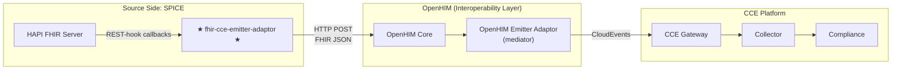
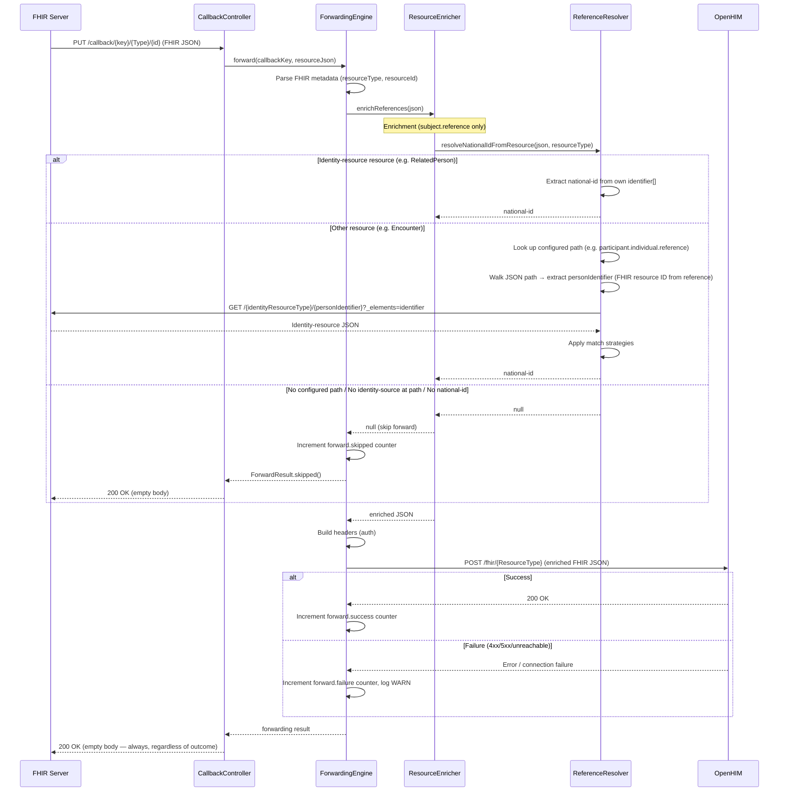

# Architecture — FHIR CCE Emitter Adaptor

## 1. Service Purpose

The **FHIR CCE Emitter Adaptor** (`fhir-cce-emitter-adaptor`) is a FHIR-specific **Emitter Adaptor** for the Care Coordination Engine (CCE) platform.

As defined in the *CCE Solution Design v0.3* (Section 4.3.7.2), an Emitter Adaptor captures events from an external system and submits them to CCE for compliance tracking. This service is the FHIR-flavored implementation: it is deployed on the **source system side** (e.g., alongside SPICE's HAPI FHIR server), subscribes to FHIR R4 resource changes via **REST-hook Subscriptions**, receives callbacks when resources change, and forwards the raw FHIR JSON to **OpenHIM**, where an **OpenHIM Emitter Adaptor** (registered as a mediator) wraps and routes events to CCE.

### Key Simplification: Inferred Matching

The adaptor does **not** need to understand CCE's compliance protocol model. Per the CCE Solution Design (Section 4.3.4.3), CCE uses **inferred matching** — it determines which protocol and step an event belongs to based on trigger definitions in the protocol configuration. The Emitter Adaptor's job is simply to capture FHIR resource changes and forward them. CCE's trigger-based matching handles the rest.

### Server-Agnostic, OpenHIM-Targeted

The service is **not coupled to any specific FHIR server implementation**. It works with any FHIR R4-compliant server that supports REST-hook subscriptions:

- HAPI FHIR Server
- IBM FHIR Server
- Firely Server
- Google Cloud Healthcare API
- Microsoft FHIR Server
- Any other FHIR R4-compliant server

The target is **OpenHIM** — the service forwards FHIR resources to OpenHIM, where an OpenHIM Emitter Adaptor (registered as a mediator) wraps them in CloudEvents envelopes and routes them to CCE.

---

## 2. Responsibilities

The FHIR CCE Emitter Adaptor has **seven core responsibilities**:

| # | Responsibility | Description |
|---|----------------|-------------|
| 1 | **Subscribe on Startup** | Register FHIR R4 REST-hook `Subscription` resources on the configured FHIR server automatically on startup |
| 2 | **Receive Callbacks** | Accept HTTP callbacks (PUT/POST) from the FHIR server when subscribed resources change |
| 3 | **Parse Metadata** | Parse incoming FHIR JSON to extract resource metadata (type, ID) using HAPI FHIR client library |
| 4 | **Ensure Patient Subject** | Ensure a `Patient/<national-id>` subject reference exists using **configurable JSON paths** per resource type — for the configured identity-resource type (default: `RelatedPerson`), extracts national-id from own identifiers; for other resources uses the configured path (`identity-resource-paths`) to locate the identity-source reference, extracts the `personIdentifier` (FHIR resource ID from the reference), fetches that resource from the FHIR server, resolves its national-id, and sets `subject.reference = "Patient/<national-id>"`; strictly skips forwarding if any step fails (no configured path, no identity-source at path, or no national-id) |
| 5 | **Forward to OpenHIM** | Forward the enriched FHIR JSON synchronously to OpenHIM — single attempt, no retry; skip forwarding (return `ForwardResult.skipped()`) when enricher returns `null` |
| 6 | **Add Auth Headers** | Attach authentication headers (Basic Auth, JWT, Custom Token) for OpenHIM |
| 7 | **Expose Observability** | Expose Prometheus metrics and Spring Boot Actuator health probes |

---

## 3. System Context Diagram

The emitter adaptor is **deployed on the source system side** — co-located with the participating system's FHIR server (e.g., SPICE's HAPI FHIR server). It taps into FHIR resource changes via REST-hook Subscriptions and forwards them to **OpenHIM**.

```
  Source System Side (e.g., SPICE)
  ════════════════════════════════════════
  ┌──────────────────┐
  │  FHIR R4 Server  │
  │  (e.g., SPICE    │
  │   HAPI FHIR)     │
  └────────┬─────────┘
           │  REST-hook Subscription callbacks
           │  (PUT/POST with FHIR JSON body)
           ▼
  ┌──────────────────────────────┐
  │                              │
  │  ★ FHIR CCE Emitter Adaptor  │
  │                              │
  │  • Receive REST-hook callback│
  │  • Parse FHIR metadata      │
  │  • Resolve references       │
  │    (RelatedPerson →       │
  │     national-id via       │
  │     configured paths)     │
  │  • Forward enriched JSON    │
  │                              │
  └──────────────┬───────────────┘
  ════════════════╪═══════════════════════
                 │
                 │  HTTP POST (enriched FHIR JSON)
                 ▼
  OpenHIM (Interoperability Layer)
  ════════════════════════════════════════
  ┌──────────────────────────────┐
  │         OpenHIM Core         │
  │  (channel → mediator)        │
  └──────────────────────────────┘
```

On startup, the `StartupSubscriptionRunner` reconciles FHIR Subscriptions on the FHIR server — creating missing ones and deleting stale adaptor-owned ones:

```
  ┌──────────────────────────────┐          ┌──────────────────┐
  │  ★ FHIR CCE Emitter Adaptor  │──FHIR──▶│  FHIR R4 Server  │
  │  StartupSubscriptionRunner   │  client  │  (create/delete   │
  │  (startup reconciliation)    │◀─────────│   Subscription)  │
  └──────────────────────────────┘          └──────────────────┘
```

> **No runtime subscription management API** — subscriptions are reconciled on startup only. There is no POST/DELETE/GET `/api/subscriptions` endpoint. Stale adaptor-owned subscriptions are automatically deleted.

---

## 4. Position in the CCE Platform

### Emitter/Receiver Adaptor Model

The CCE platform uses an **Emitter/Receiver Adaptor** model (*CCE Solution Design v0.3*, Section 4.3.7):

- **Emitter Adaptors** capture clinical events from external systems and route them toward CCE for compliance tracking.
- **Receiver Adaptors** receive intelligence events from CCE and translate them into actions in target systems.

This service is a **FHIR-specific Emitter Adaptor**. It is deployed on the **source system side** — co-located with the participating system's FHIR server (e.g., SPICE's HAPI FHIR server). It captures FHIR resource changes (Encounters, Observations, ServiceRequests, etc.) via REST-hook Subscriptions and forwards them to **OpenHIM**. It does not wrap payloads in CloudEvents — that transformation happens downstream in the **OpenHIM Emitter Adaptor** (a mediator registered in OpenHIM that routes events to CCE).

### Where This Service Fits

The emitter adaptor sits on the **source system side**, co-deployed alongside the participating system's FHIR server.



The FHIR CCE Emitter Adaptor is part of the **source-side infrastructure**. It taps into the local FHIR server's REST-hook Subscriptions and forwards captured FHIR resources to OpenHIM. The **OpenHIM Emitter Adaptor** (registered as a mediator in OpenHIM) handles CloudEvents wrapping and routing to CCE.

---

## 5. Typical Deployment Flows

### Deployment Flow

```
  Source Side (e.g., SPICE)
  ══════════════════════════════════
  FHIR R4 Server (SPICE HAPI FHIR)
       │ REST-hook Subscription callbacks
       ▼
  ┌─────────────────────────────┐
  │  ★ FHIR CCE Emitter Adaptor │
  │  Receive callback → Forward │
  └──────────────┬──────────────┘
  ═══════════════╪══════════════════
                 │ HTTP POST (FHIR JSON)
                 ▼
  OpenHIM (Interoperability Layer)
  ══════════════════════════════════
  ┌─────────────────────────────┐
  │  OpenHIM Core                │
  │  Route → Mediator            │
  └──────────────┬──────────────┘
                 │
                 ▼
  ┌─────────────────────────────┐
  │  OpenHIM Emitter Adaptor     │
  │  (mediator: CloudEvents wrap)│
  └──────────────┬──────────────┘
  ═══════════════╪══════════════════
                 │ CloudEvents envelope
                 ▼
  CCE Platform
  ══════════════════════════════════
  ┌─────────────────────────────┐
  │  CCE Gateway → Collector     │
  │  Validate → Kafka → Comply   │
  └─────────────────────────────┘
```

---

## 6. Technology Stack

| Concern | Technology | Version |
|---------|------------|---------|
| Language | Java | 21 (LTS) |
| Framework | Spring Boot | 3.4.x |
| Build tool | Gradle (Groovy DSL) | 8.x |
| FHIR library | HAPI FHIR Client | 7.4.0 |
| HTTP client | Spring `RestTemplate` | (Spring Boot managed) |
| Observability | SLF4J + Logback, Micrometer, Prometheus | (Spring Boot managed) |
| Monitoring | Spring Boot Actuator | (Spring Boot managed) |
| Testing | JUnit 5, MockMvc, Mockito, WireMock | (Spring Boot managed / 3.9.1) |
| Container runtime | Eclipse Temurin | 21 (JDK build, JRE runtime) |

### Key Gradle Dependencies

```kotlin
// HAPI FHIR (client library for FHIR R4 — not server-specific)
implementation("ca.uhn.hapi.fhir:hapi-fhir-base:$hapiFhirVersion")
implementation("ca.uhn.hapi.fhir:hapi-fhir-client:$hapiFhirVersion")
implementation("ca.uhn.hapi.fhir:hapi-fhir-structures-r4:$hapiFhirVersion")

// Spring Boot starters
implementation("org.springframework.boot:spring-boot-starter-web")
implementation("org.springframework.boot:spring-boot-starter-validation")
implementation("org.springframework.boot:spring-boot-starter-actuator")

// Metrics
runtimeOnly("io.micrometer:micrometer-registry-prometheus")

// Testing
testImplementation("org.wiremock:wiremock-standalone:3.9.1")
```

> **Note:** The HAPI FHIR Client library is a **Java FHIR SDK** — it speaks standard FHIR REST API and is NOT tied to any specific FHIR server implementation.

---

## 7. Package Structure

```
src/main/java/org/openphc/cce/emitter/
├── FhirCceEmitterAdaptorApplication.java         # Spring Boot entry point
├── config/
│   ├── EmitterProperties.java                    # @ConfigurationProperties(prefix="emitter")
│   ├── FhirConfig.java                           # FhirContext.forR4() singleton bean
│   ├── LoggingFilter.java                        # MDC request tracing filter
│   ├── ObservabilityConfig.java                  # Micrometer metrics registration
│   ├── RestClientConfig.java                     # RestTemplate + trust-all RestTemplate beans
│   └── StartupSubscriptionRunner.java            # Auto-subscribe on startup (@ConditionalOnProperty)
├── controller/
│   └── SubscriptionCallbackController.java       # REST-hook callback endpoint (/callback/**)
└── service/
    ├── FhirClientFactory.java                    # Authenticated HAPI FHIR client creation (shared)
    ├── ForwardingEngine.java                     # Enriches + forwards FHIR JSON to OpenHIM (single attempt, no retry)
    ├── ForwardResult.java                        # Forwarding outcome record
    ├── RegistrationResult.java                   # Subscription registration outcome record
    ├── ReferenceResolver.java                    # Resolves national-id from FHIR resources: path lookup, identity-source detection, fetch, multi-strategy matching
    ├── ResourceEnricher.java                     # Sets subject.reference = Patient/<national-id> using ReferenceResolver
    ├── SubscriptionRegistrationService.java      # FHIR Subscription creation on server (startup-only)
    └── TokenEndpointAuthService.java             # Token endpoint + OAuth2 token fetching
```

### Test Structure

```
src/test/java/org/openphc/cce/emitter/
├── FhirCceEmitterAdaptorApplicationTests.java    # Context load test
├── config/
│   └── StartupSubscriptionRunnerTest.java        # Startup auto-subscription tests
├── controller/
│   └── SubscriptionCallbackControllerTest.java   # Callback endpoint tests (8)
├── service/
│   ├── ForwardingEngineTest.java                 # Forwarding + error handling tests (28)
│   ├── TokenEndpointAuthServiceTest.java         # Token extraction + caching tests (22)
│   └── SubscriptionRegistrationServiceTest.java  # Subscription creation + auth tests (13)
└── integration/
    └── ...                                       # WireMock-based integration tests (20+)
```

---

## 8. Processing Flows

### 8.1 Callback → Forward Flow (core path)

This is the primary processing path — the synchronous pipeline from FHIR server callback to OpenHIM:

| Step | Component | Action |
|------|-----------|--------|
| 1 | **FHIR Server** | Sends REST-hook callback: `PUT /callback/{callbackKey}/{ResourceType}/{id}` with full FHIR resource JSON body |
| 2 | **SubscriptionCallbackController** | Receives request, logs metadata (method, callbackKey, URI, payload size) |
| 3 | **SubscriptionCallbackController** | Calls `ForwardingEngine.forward()` synchronously |
| 4 | **ForwardingEngine** | Increments `callbacks.received` counter |
| 5 | **ForwardingEngine** | Parses FHIR resource metadata: `fhirContext.newJsonParser().parseResource()` → extract `resourceType` and `resourceId`; falls back to `"Unknown"` on parse failure |
| 6 | **ResourceEnricher** | Calls `ReferenceResolver.resolveNationalIdFromResource()` to obtain the national-id, then sets `subject.reference = "Patient/<national-id>"`. **Only `subject.reference` is modified** — all other references are forwarded as-is. Returns null (skip forward) if the resolver returns null. |
| 7 | **ReferenceResolver** | Orchestrates the full resolution flow: (a) if the resource IS the configured **identity-resource type** (default: `RelatedPerson`, configurable via `identity-resource-type`), extracts national-id from its own `identifier[]`; (b) for other resources, looks up the configured path from `identity-resource-paths`, walks the JSON to find the identity-source reference (`personIdentifier` — the FHIR resource ID extracted from the reference string, e.g. `"499063"` from `"RelatedPerson/499063"`), fetches that resource via `GET /{type}/{personIdentifier}?_elements=identifier`, then applies match strategies (`use-official` → `type-code` → `system-suffix`); first match wins. **Strict** — returns null if any step fails (no configured path, no identity-source reference at path, no national-id). |
| 8 | **ForwardingEngine** | If enricher returns `null`, increments `forward.skipped` counter and returns `ForwardResult.skipped()` — no OpenHIM call |
| 9 | **ForwardingEngine** | Builds OpenHIM URL: `baseUrl + "/" + resourceType` if `append-resource-type: true`, otherwise just `baseUrl` |
| 10 | **ForwardingEngine** | Builds headers: auth (Basic Auth, JWT, Custom Token, or none) |
| 11 | **ForwardingEngine** | POSTs enriched JSON to OpenHIM via RestTemplate (trust-all or standard); single attempt, no retry. Failures are logged and metered. |
| 12 | **SubscriptionCallbackController** | Always returns `200 OK` with empty body to HAPI FHIR regardless of forwarding outcome. Returning any non-FHIR body (including error envelopes) or non-2xx causes HAPI FHIR's internal FHIR client to throw `DataFormatException`, triggering infinite redelivery via `RetryingMessageHandlerWrapper`. Failures are logged and metered. |

**Success:** Increments `forward.success` counter, records `forward.duration` timer. Returns `200 OK` with empty body.
**Skipped:** Increments `forward.skipped` counter. Returns `200 OK` with empty body (ACK to FHIR server).
**Failure:** Increments `forward.failure` counter, logs `WARN`. Always returns `200 OK` with empty body to HAPI FHIR — returning a non-FHIR body or non-2xx status causes HAPI FHIR's delivery client to throw `DataFormatException`, which `RetryingMessageHandlerWrapper` retries indefinitely.

#### Sequence Diagram



### 8.2 Startup Auto-Subscription Flow

When `emitter.startup-subscriptions.enabled=true`, the service reconciles subscriptions on startup — creating missing ones and deleting stale adaptor-owned ones:

| Step | Component | Action |
|------|-----------|--------|
| 1 | **StartupSubscriptionRunner** | `ApplicationRunner.run()` triggered by Spring after context initialization |
| 2 | **StartupSubscriptionRunner** | Reads resource types from `emitter.startup-subscriptions.resource-types` configuration |
| 3 | **StartupSubscriptionRunner** | Sleeps for `delay-seconds` (default 10s) to allow the FHIR server to become ready |
| 4 | **StartupSubscriptionRunner** | Parses entries and delegates to `registrationService.subscribeAll(resourceTypeEntries)` |
| 5 | **SubscriptionRegistrationService** | Bulk-fetches existing **adaptor-owned** subscriptions from the FHIR server by owner tag (`https://openphc.org/cce/fhir-emitter|fhir-cce-emitter-adaptor`). Only tagged subscriptions are loaded — non-adaptor subscriptions are never seen. |
| 6 | **SubscriptionRegistrationService** | For each configured resource type: if an adaptor-owned subscription already exists, creation is skipped (`already-exists`); otherwise, a new subscription is created (`registered`). |
| 7 | **SubscriptionRegistrationService** | Identifies stale subscriptions — adaptor-owned subscriptions on the server whose resource type is no longer in the configured list — and deletes them (`deleted`). Delete failures are non-fatal (`delete-failed`). |
| 8 | **StartupSubscriptionRunner** | Logs per-resource result and summary (N succeeded, M deleted, P failed); failures do NOT stop remaining operations or prevent application startup |

> **Adaptor-owned subscriptions only:** The service identifies its own subscriptions by the owner tag (`https://openphc.org/cce/fhir-emitter|fhir-cce-emitter-adaptor`) added to each subscription's `meta.tag[]`. Only tagged subscriptions are loaded during the bulk-fetch query — non-adaptor subscriptions (created by other systems or tools) are completely invisible to the reconciliation logic and are **never modified or deleted**.

> **Non-fatal by design:** Startup subscription failures (both creation and deletion) are logged but never thrown. The FHIR server may not be ready yet, or some resource types may not be supported. The emitter continues to operate — on the next restart, reconciliation will be re-attempted.

---

## 9. Stateless Design

The FHIR CCE Emitter Adaptor is **intentionally stateless** — it has no database and no persistent local state:

| Aspect | Design |
|--------|--------|
| **Subscription tracking** | In-memory `HashMap` keyed by `resourceType|criteria` — built fresh from FHIR server bulk-fetch (by owner tag) on each startup; used for duplicate detection during creation and for identifying stale subscriptions to delete |
| **Auto-resubscription** | With `startup-subscriptions.enabled=true`, subscriptions are reconciled automatically on restart: missing ones are created, stale adaptor-owned ones are deleted. Non-adaptor subscriptions are never touched. |
| **Token cache** | In-memory `ConcurrentHashMap` keyed by token URL — rebuilt on first use after restart |
| **No DB required** | No Flyway, no JPA, no PostgreSQL — zero data persistence infrastructure |
| **Single instance** | Designed to run as a single instance (in-memory tracking is not shared) |

### Why Stateless?

- The FHIR server is the source of truth for subscriptions, not the emitter.
- REST-hook subscriptions persist on the FHIR server even when the emitter restarts.
- The `StartupSubscriptionRunner` reconciles subscriptions on each startup — if an adaptor-owned subscription already exists (detected by owner tag), creation is skipped. Stale adaptor-owned subscriptions for resource types no longer in the configured list are deleted. Non-adaptor subscriptions on the same server are completely ignored.
- No event deduplication required — the FHIR server manages subscription state; CCE handles idempotency via CloudEvents `id` + `source` downstream.

---

## 10. Multi-Auth Architecture

### FHIR Server Authentication

The service supports five authentication types for connecting to the FHIR server:

| Type | Description | Configuration Fields |
|------|-------------|---------------------|
| `none` | No authentication | — |
| `basic` | HTTP Basic Auth | `username`, `password` |
| `bearer` | Static Bearer token | `token` |
| `token-endpoint` | Fetch token from an HTTP endpoint (e.g., Keycloak, custom auth service) | `token-url`, `username`, `password`, `client` |
| `oauth2` | OAuth2 Client Credentials grant (industry standard) | `token-url`, `client-id`, `client-secret`, `scope` |

The `token-endpoint` type authenticates by POSTing credentials to a configurable token URL. Token extraction supports multiple response formats:
1. `Set-Cookie` header (configurable cookie name, optional base64 decoding)
2. `Authorization` response header
3. JSON response body field (configurable field name)
4. Raw response body (fallback)

The `oauth2` type implements the standard **OAuth2 Client Credentials grant** (`grant_type=client_credentials`). It POSTs `client_id`, `client_secret`, and optional `scope` to the token URL and extracts `access_token` from the JSON response. If `expires_in` is present in the response, it is used for token TTL; otherwise, the configured `token-ttl-seconds` (default: 3600) is used. This is the industry standard for server-to-server authentication with Keycloak, Azure AD, Google Cloud, Okta, Auth0, and other OAuth2 providers.

### OpenHIM Authentication

OpenHIM supports multiple client authentication mechanisms. It supports four authentication types:

| Type | Description | Configuration Fields |
|------|-------------|---------------------|
| `none` | No authentication | — |
| `basic` | HTTP Basic Auth | `username`, `password` |
| `jwt` | JSON Web Token | `token` |
| `custom-token` | OpenHIM Custom Token | `token` |

---

## 11. What This Service Does NOT Do

| Exclusion | Rationale |
|-----------|-----------|
| **Transform FHIR resource structure** | Enrichment is limited to setting `subject.reference` to `Patient/<national-id>` using the national-id resolved from the RelatedPerson at the configured path; all other fields are forwarded as-is. Full structural transformation happens downstream (OpenHIM Emitter Adaptor mediator or CCE). |
| **Wrap in CloudEvents envelopes** | CloudEvents wrapping happens in the OpenHIM Emitter Adaptor (mediator) or CCE Collector Service |
| **Validate FHIR profile conformance** | Only structural parse for metadata extraction (type, ID); no profile validation |
| **Persist state to a database** | Stateless — subscription tracking is in-memory, reconciled from server |
| **Produce or consume Kafka events** | HTTP-only forwarding; Kafka is used within CCE core, not in adaptors |
| **Deduplicate events** | FHIR server manages subscription state; CCE handles idempotency via CloudEvents `id` + `source` |
| **Rate-limit or apply mTLS** | Infrastructure-layer concerns handled by API gateway / service mesh |
| **Perform compliance tracking** | That is CCE core's responsibility (Compliance Service) |
| **Act as a Receiver Adaptor** | It only emits events toward CCE; it does not receive intelligence events from CCE |
