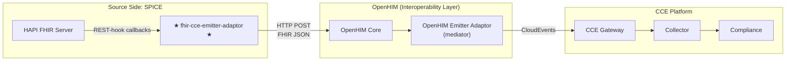
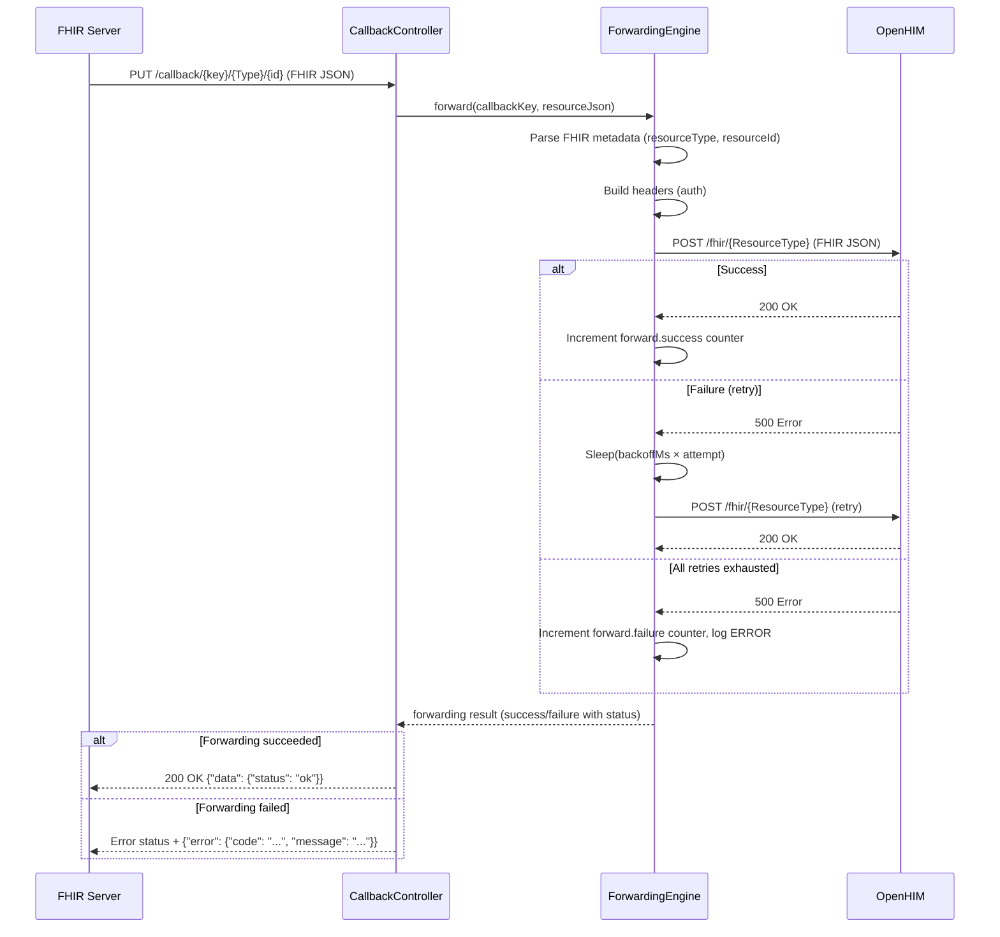

# Architecture — FHIR CCE Emitter Adaptor

## 1. Service Purpose

The **FHIR CCE Emitter Adaptor** (`fhir-cce-emitter-adaptor`) is a FHIR-specific **Emitter Adaptor** for the Care Coordination Engine (CCE) platform.

As defined in the *CCE Solution Design v0.3* (Section 4.3.7.2), an Emitter Adaptor captures events from an external system and submits them to CCE for compliance tracking. This service is the FHIR-flavored implementation: it is deployed on the **source system side** (e.g., alongside SPICE's HAPI FHIR server), subscribes to FHIR R4 resource changes via **REST-hook Subscriptions**, receives callbacks when resources change, and forwards the raw FHIR JSON to **OpenHIM**, where an **OpenHIM Emitter Adaptor** (registered as a mediator) wraps and routes events to CCE.

### Key Simplification: Inferred Matching

The adaptor does **not** need to understand CCE's compliance protocol model. Per the CCE Solution Design (Section 4.3.4.3), CCE uses **inferred matching** — it determines which protocol and step an event belongs to based on trigger definitions in the protocol configuration. The Emitter Adaptor's job is simply to capture FHIR resource changes and forward them. CCE's trigger-based matching handles the rest.

### Server-Agnostic, OpenHIM-Targeted

The service is **not coupled to any specific FHIR server implementation**. It works with any FHIR R4-compliant server that supports REST-hook subscriptions:

- HAPI FHIR Server
- IBM FHIR Server
- Firely Server
- Google Cloud Healthcare API
- Microsoft FHIR Server
- Any other FHIR R4-compliant server

The target is **OpenHIM** — the service forwards FHIR resources to OpenHIM, where an OpenHIM Emitter Adaptor (registered as a mediator) wraps them in CloudEvents envelopes and routes them to CCE.

---

## 2. Responsibilities

The FHIR CCE Emitter Adaptor has **seven core responsibilities**:

| # | Responsibility | Description |
|---|----------------|-------------|
| 1 | **Subscribe on Startup** | Register FHIR R4 REST-hook `Subscription` resources on the configured FHIR server automatically on startup |
| 2 | **Receive Callbacks** | Accept HTTP callbacks (PUT/POST) from the FHIR server when subscribed resources change |
| 3 | **Parse Metadata** | Parse incoming FHIR JSON to extract resource metadata (type, ID) using HAPI FHIR client library |
| 4 | **Forward to OpenHIM** | Forward the raw FHIR JSON synchronously to OpenHIM |
| 5 | **Add Auth Headers** | Attach authentication headers (Basic Auth) for OpenHIM |
| 6 | **Retry with Backoff** | Retry failed forwards with configurable linear backoff |
| 7 | **Expose Observability** | Expose Prometheus metrics and Spring Boot Actuator health probes |

---

## 3. System Context Diagram

The emitter adaptor is **deployed on the source system side** — co-located with the participating system's FHIR server (e.g., SPICE's HAPI FHIR server). It taps into FHIR resource changes via REST-hook Subscriptions and forwards them to the target system (typically OpenHIM).

```
  Source System Side (e.g., SPICE)
  ════════════════════════════════════════
  ┌──────────────────┐
  │  FHIR R4 Server  │
  │  (e.g., SPICE    │
  │   HAPI FHIR)     │
  └────────┬─────────┘
           │  REST-hook Subscription callbacks
           │  (PUT/POST with FHIR JSON body)
           ▼
  ┌──────────────────────────────┐
  │                              │
  │  ★ FHIR CCE Emitter Adaptor  │
  │                              │
  │  • Receive REST-hook callback│
  │  • Parse FHIR metadata      │
  │  • Forward to OpenHIM       │
  │  • Retry with backoff       │
  │                              │
  └──────────────┬───────────────┘
  ════════════════╪═══════════════════════
                 │
                 │  HTTP POST (raw FHIR JSON)
                 ▼
  OpenHIM (Interoperability Layer)
  ════════════════════════════════════════
  ┌──────────────────────────────┐
  │         OpenHIM Core         │
  │  (channel → mediator)        │
  └──────────────────────────────┘
```

On startup, the `StartupSubscriptionRunner` registers FHIR Subscriptions on the FHIR server:

```
  ┌──────────────────────────────┐          ┌──────────────────┐
  │  ★ FHIR CCE Emitter Adaptor  │──FHIR──▶│  FHIR R4 Server  │
  │  StartupSubscriptionRunner   │  client  │  (create         │
  │  (startup auto-subscribe)    │◀─────────│   Subscription)  │
  └──────────────────────────────┘          └──────────────────┘
```

> **No runtime subscription management API** — subscriptions are registered once on startup. There is no POST/DELETE/GET `/api/subscriptions` endpoint.

---

## 4. Position in the CCE Platform

### Emitter/Receiver Adaptor Model

The CCE platform uses an **Emitter/Receiver Adaptor** model (*CCE Solution Design v0.3*, Section 4.3.7):

- **Emitter Adaptors** capture clinical events from external systems and route them toward CCE for compliance tracking.
- **Receiver Adaptors** receive intelligence events from CCE and translate them into actions in target systems.

This service is a **FHIR-specific Emitter Adaptor**. It is deployed on the **source system side** — co-located with the participating system's FHIR server (e.g., SPICE's HAPI FHIR server). It captures FHIR resource changes (Encounters, Observations, ServiceRequests, etc.) via REST-hook Subscriptions and forwards them to the configured target system (typically OpenHIM). It does not wrap payloads in CloudEvents — that transformation happens downstream in the **OpenHIM Emitter Adaptor** (a mediator registered in OpenHIM that routes events to CCE).

### Where This Service Fits

The emitter adaptor sits on the **source system side**, co-deployed alongside the participating system's FHIR server.



The FHIR CCE Emitter Adaptor is part of the **source-side infrastructure**. It taps into the local FHIR server's REST-hook Subscriptions and forwards captured FHIR resources to OpenHIM. The **OpenHIM Emitter Adaptor** (registered as a mediator in OpenHIM) handles CloudEvents wrapping and routing to CCE.

---

## 5. Typical Deployment Flows

### Deployment Flow

```
  Source Side (e.g., SPICE)
  ══════════════════════════════════
  FHIR R4 Server (SPICE HAPI FHIR)
       │ REST-hook Subscription callbacks
       ▼
  ┌─────────────────────────────┐
  │  ★ FHIR CCE Emitter Adaptor │
  │  Receive callback → Forward │
  └──────────────┬──────────────┘
  ═══════════════╪══════════════════
                 │ HTTP POST (FHIR JSON)
                 ▼
  OpenHIM (Interoperability Layer)
  ══════════════════════════════════
  ┌─────────────────────────────┐
  │  OpenHIM Core                │
  │  Route → Mediator            │
  └──────────────┬──────────────┘
                 │
                 ▼
  ┌─────────────────────────────┐
  │  OpenHIM Emitter Adaptor     │
  │  (mediator: CloudEvents wrap)│
  └──────────────┬──────────────┘
  ═══════════════╪══════════════════
                 │ CloudEvents envelope
                 ▼
  CCE Platform
  ══════════════════════════════════
  ┌─────────────────────────────┐
  │  CCE Gateway → Collector     │
  │  Validate → Kafka → Comply   │
  └─────────────────────────────┘
```

---

## 6. Technology Stack

| Concern | Technology | Version |
|---------|------------|---------|
| Language | Java | 21 (LTS) |
| Framework | Spring Boot | 3.4.x |
| Build tool | Gradle (Groovy DSL) | 8.x |
| FHIR library | HAPI FHIR Client | 7.4.0 |
| HTTP client | Spring `RestTemplate` | (Spring Boot managed) |
| Observability | SLF4J + Logback, Micrometer, Prometheus | (Spring Boot managed) |
| Monitoring | Spring Boot Actuator | (Spring Boot managed) |
| Testing | JUnit 5, MockMvc, Mockito, WireMock | (Spring Boot managed / 3.9.1) |
| Container runtime | Eclipse Temurin | 21 (JDK build, JRE runtime) |

### Key Gradle Dependencies

```kotlin
// HAPI FHIR (client library for FHIR R4 — not server-specific)
implementation("ca.uhn.hapi.fhir:hapi-fhir-base:$hapiFhirVersion")
implementation("ca.uhn.hapi.fhir:hapi-fhir-client:$hapiFhirVersion")
implementation("ca.uhn.hapi.fhir:hapi-fhir-structures-r4:$hapiFhirVersion")

// Spring Boot starters
implementation("org.springframework.boot:spring-boot-starter-web")
implementation("org.springframework.boot:spring-boot-starter-validation")
implementation("org.springframework.boot:spring-boot-starter-actuator")

// Metrics
runtimeOnly("io.micrometer:micrometer-registry-prometheus")

// Testing
testImplementation("org.wiremock:wiremock-standalone:3.9.1")
```

> **Note:** The HAPI FHIR Client library is a **Java FHIR SDK** — it speaks standard FHIR REST API and is NOT tied to any specific FHIR server implementation.

---

## 7. Package Structure

```
src/main/java/org/openphc/cce/emitter/
├── FhirCceEmitterAdaptorApplication.java         # Spring Boot entry point
├── config/
│   ├── FhirConfig.java                           # FhirContext.forR4() singleton bean
│   ├── EmitterProperties.java                    # @ConfigurationProperties(prefix="emitter")
│   ├── LoggingFilter.java                        # MDC request tracing filter
│   ├── ObservabilityConfig.java                  # Micrometer metrics registration
│   ├── RestClientConfig.java                     # RestTemplate + trust-all RestTemplate beans
│   ├── StartupSubscriptionRunner.java            # Auto-subscribe on startup (@ConditionalOnProperty)
│   └── health/
│       ├── FhirServerHealthIndicator.java        # FHIR server /metadata health check
│       └── TargetHealthIndicator.java            # Target HEAD health check
├── controller/
│   └── SubscriptionCallbackController.java       # REST-hook callback endpoint (/callback/**)
├── service/
│   ├── ForwardingEngine.java                     # Synchronous forwarding to OpenHIM with retry
│   ├── TokenEndpointAuthService.java             # Token endpoint auth (Keycloak, custom, etc.)
│   └── SubscriptionRegistrationService.java      # FHIR Subscription creation on server (startup-only)
```

### Test Structure

```
src/test/java/org/openphc/cce/emitter/
├── FhirCceEmitterAdaptorApplicationTests.java    # Context load test
├── config/
│   └── StartupSubscriptionRunnerTest.java        # Startup auto-subscription tests
├── controller/
│   └── SubscriptionCallbackControllerTest.java   # Callback endpoint tests (8)
├── service/
│   ├── ForwardingEngineTest.java                 # Forwarding + retry tests (23)
│   ├── TokenEndpointAuthServiceTest.java         # Token extraction + caching tests (22)
│   └── SubscriptionRegistrationServiceTest.java  # Subscription creation + auth tests (13)
└── integration/
    └── ...                                       # WireMock-based integration tests (20+)
```

---

## 8. Processing Flows

### 8.1 Callback → Forward Flow (core path)

This is the primary processing path — the synchronous pipeline from FHIR server callback to OpenHIM:

| Step | Component | Action |
|------|-----------|--------|
| 1 | **FHIR Server** | Sends REST-hook callback: `PUT /callback/{callbackKey}/{ResourceType}/{id}` with full FHIR resource JSON body |
| 2 | **SubscriptionCallbackController** | Receives request, logs metadata (method, callbackKey, URI, payload size) |
| 3 | **SubscriptionCallbackController** | Calls `ForwardingEngine.forward()` synchronously |
| 4 | **ForwardingEngine** | Increments `callbacks.received` counter |
| 5 | **ForwardingEngine** | Parses FHIR resource metadata: `fhirContext.newJsonParser().parseResource()` → extract `resourceType` and `resourceId`; falls back to `"Unknown"` on parse failure |
| 6 | **ForwardingEngine** | Builds target URL: `baseUrl + "/" + resourceType` if `append-resource-type: true`, otherwise just `baseUrl` |
| 7 | **ForwardingEngine** | Builds headers: auth (Basic Auth, JWT, Custom Token, or none) |
| 8 | **ForwardingEngine** | POSTs to OpenHIM via RestTemplate (trust-all or standard); retries up to `maxAttempts` with linear backoff (`backoffMs × attempt`) on failure |
| 9 | **SubscriptionCallbackController** | Returns response using CCE platform envelope convention. On success: `200 OK` with `{"data": {"status": "ok"}}`. On failure: the error status from OpenHIM with `{"error": {"code": "FORWARDING_ERROR", "message": "..."}}`. If unreachable: `502` with `{"error": {"code": "TARGET_UNREACHABLE", "message": "..."}}`. |

**Success:** Increments `forward.success` counter, records `forward.duration` timer. Returns `200 OK` with `{"data": {"status": "ok"}}`.
**Failure (all retries exhausted):** Increments `forward.failure` counter, logs `ERROR`. Returns the error status from OpenHIM with `{"error": {"code": "FORWARDING_ERROR", "message": "Forwarding to OpenHIM failed: <detail>"}}`. If OpenHIM is unreachable, returns `502 Bad Gateway` with `{"error": {"code": "TARGET_UNREACHABLE", "message": "OpenHIM unreachable after N attempts"}}`.

#### Sequence Diagram



### 8.2 Startup Auto-Subscription Flow

When `emitter.startup-subscriptions.enabled=true`, the service automatically subscribes to the configured FHIR resource types on startup:

| Step | Component | Action |
|------|-----------|--------|
| 1 | **StartupSubscriptionRunner** | `ApplicationRunner.run()` triggered by Spring after context initialization |
| 2 | **StartupSubscriptionRunner** | Reads resource types from `emitter.startup-subscriptions.resource-types` configuration (21 defaults) |
| 3 | **StartupSubscriptionRunner** | Sleeps for `delay-seconds` (default 10s) to allow the FHIR server to become ready |
| 4 | **StartupSubscriptionRunner** | Iterates each resource type, calling `registrationService.subscribe(resourceType, null)` |
| 5 | **SubscriptionRegistrationService** | Checks for existing **adaptor-owned** subscriptions on the server (matching callback URL prefix). If an adaptor subscription already exists for this resource type, creation is skipped (`already-exists`). Non-adaptor subscriptions (created by other systems) are **never modified or deleted**. |
| 6 | **StartupSubscriptionRunner** | Logs per-resource result and summary (N succeeded, M skipped, P failed); failures do NOT stop remaining subscriptions or prevent application startup |

> **Adaptor-owned subscriptions only:** The service identifies its own subscriptions by matching the callback URL prefix (`self-base-url + "/callback/"`). Subscriptions created by other systems or tools on the same FHIR server are completely ignored — the emitter never modifies, deletes, or interferes with non-adaptor subscriptions.

> **Non-fatal by design:** Startup subscription failures are logged but never thrown. The FHIR server may not be ready yet, or some resource types may not be supported. The emitter continues to operate — on the next restart, subscriptions will be re-attempted.

---

## 9. Stateless Design

The FHIR CCE Emitter Adaptor is **intentionally stateless** — it has no database and no persistent local state:

| Aspect | Design |
|--------|--------|
| **Subscription tracking** | In-memory `ConcurrentHashMap` keyed by `resourceType|criteria` — used for duplicate detection during startup registration; lost on restart |
| **Auto-resubscription** | With `startup-subscriptions.enabled=true`, subscriptions are re-established automatically on restart. If an adaptor-owned subscription already exists, creation is skipped (`already-exists`). Non-adaptor subscriptions are never touched. |
| **Token cache** | In-memory `ConcurrentHashMap` keyed by token URL — rebuilt on first use after restart |
| **No DB required** | No Flyway, no JPA, no PostgreSQL — zero data persistence infrastructure |
| **Single instance** | Designed to run as a single instance (in-memory tracking is not shared) |

### Why Stateless?

- The FHIR server is the source of truth for subscriptions, not the emitter.
- REST-hook subscriptions persist on the FHIR server even when the emitter restarts.
- The `StartupSubscriptionRunner` re-registers subscriptions on each startup — if an adaptor-owned subscription already exists (detected by matching callback URL prefix), creation is skipped. Non-adaptor subscriptions on the same server are completely ignored.
- No event deduplication required — the FHIR server manages subscription state; CCE handles idempotency via CloudEvents `id` + `source` downstream.

---

## 10. Multi-Auth Architecture

### FHIR Server Authentication

The service supports five authentication types for connecting to the FHIR server:

| Type | Description | Configuration Fields |
|------|-------------|---------------------|
| `none` | No authentication | — |
| `basic` | HTTP Basic Auth | `username`, `password` |
| `bearer` | Static Bearer token | `token` |
| `token-endpoint` | Fetch token from an HTTP endpoint (e.g., Keycloak, custom auth service) | `token-url`, `username`, `password`, `client` |
| `oauth2` | OAuth2 Client Credentials grant (industry standard) | `token-url`, `client-id`, `client-secret`, `scope` |

The `token-endpoint` type authenticates by POSTing credentials to a configurable token URL. Token extraction supports multiple response formats:
1. `Set-Cookie` header (configurable cookie name, optional base64 decoding)
2. `Authorization` response header
3. JSON response body field (configurable field name)
4. Raw response body (fallback)

The `oauth2` type implements the standard **OAuth2 Client Credentials grant** (`grant_type=client_credentials`). It POSTs `client_id`, `client_secret`, and optional `scope` to the token URL and extracts `access_token` from the JSON response. If `expires_in` is present in the response, it is used for token TTL; otherwise, the configured `token-ttl-seconds` (default: 3600) is used. This is the industry standard for server-to-server authentication with Keycloak, Azure AD, Google Cloud, Okta, Auth0, and other OAuth2 providers.

### Target Authentication (OpenHIM)

OpenHIM supports multiple client authentication mechanisms. The target supports four authentication types:

| Type | Description | Configuration Fields |
|------|-------------|---------------------|
| `none` | No authentication | — |
| `basic` | HTTP Basic Auth | `username`, `password` |
| `jwt` | JSON Web Token | `token` |
| `custom-token` | OpenHIM Custom Token | `token` |

---

## 11. What This Service Does NOT Do

| Exclusion | Rationale |
|-----------|-----------|
| **Transform or enrich FHIR resources** | Resources are forwarded as-is; transformation happens downstream (OpenHIM Emitter Adaptor mediator or CCE) |
| **Wrap in CloudEvents envelopes** | CloudEvents wrapping happens in the OpenHIM Emitter Adaptor (mediator) or CCE Collector Service |
| **Validate FHIR profile conformance** | Only structural parse for metadata extraction (type, ID); no profile validation |
| **Persist state to a database** | Stateless — subscription tracking is in-memory, reconciled from server |
| **Produce or consume Kafka events** | HTTP-only forwarding; Kafka is used within CCE core, not in adaptors |
| **Deduplicate events** | FHIR server manages subscription state; CCE handles idempotency via CloudEvents `id` + `source` |
| **Rate-limit or apply mTLS** | Infrastructure-layer concerns handled by API gateway / service mesh |
| **Perform compliance tracking** | That is CCE core's responsibility (Compliance Service) |
| **Act as a Receiver Adaptor** | It only emits events toward CCE; it does not receive intelligence events from CCE |
